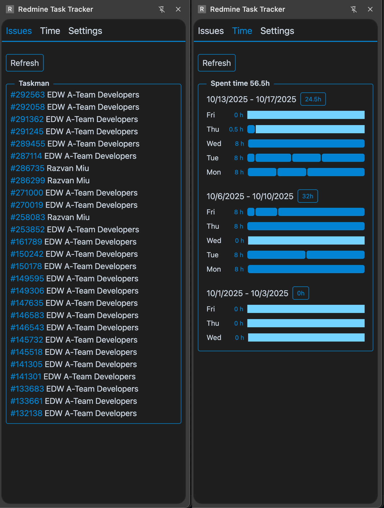

# Redmine Task Tracker Extension

A Chrome extension that helps you track and manage your Redmine tasks directly from your browser.

## Features

- View your Redmine tasks in a convenient sidebar
- Track time spent on tasks
- Quick access to your most important Redmine items

## Prerequisites

- npm or yarn
- Chrome or any Chromium-based browser

## Installation

1. Clone the repository:

   ```bash
   git clone https://github.com/yourusername/redmine-extension.git
   cd redmine-extension
   ```

2. Install dependencies:

   ```bash
   npm install
   # or
   yarn
   ```

3. Build the extension:
   ```bash
   npm run build
   # or
   yarn build
   ```

## Loading the Extension in Chrome

1. Open Chrome and navigate to `chrome://extensions/`
2. Enable "Developer mode" (toggle in the top-right corner)
3. Click "Load unpacked"
4. Select the `dist` directory from the project

## Development

To start the development server with hot-reload:

```bash
npm run dev
# or
yarn dev
```

## Building for Production

To build the extension for production:

```bash
npm run build
# or
yarn build
```

The production build will be available in the `dist` directory.

## Technologies Used

- [SolidJS](https://www.solidjs.com/) - A declarative JavaScript library for building user interfaces
- [Vite](https://vitejs.dev/) - Next Generation Frontend Tooling
- [Tailwind CSS](https://tailwindcss.com/) - A utility-first CSS framework

## Contributing

Contributions are welcome! Please feel free to submit a Pull Request.

## License

This project is licensed under the MIT License - see the [LICENSE.md](LICENSE.md) file for details.

## Support

For support, please open an issue in the GitHub repository.

## Screenshots



---

Happy tracking! 🚀
